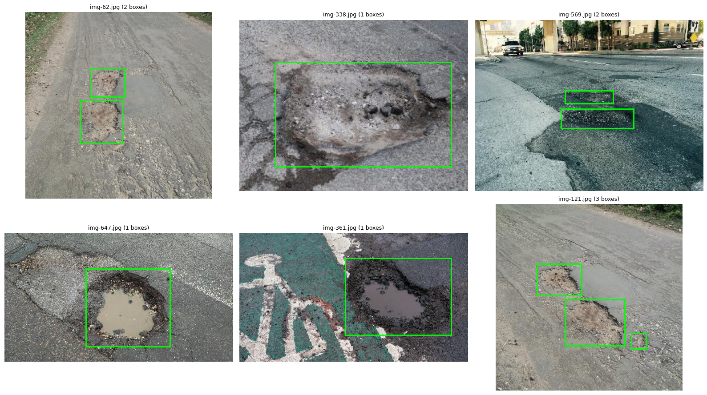
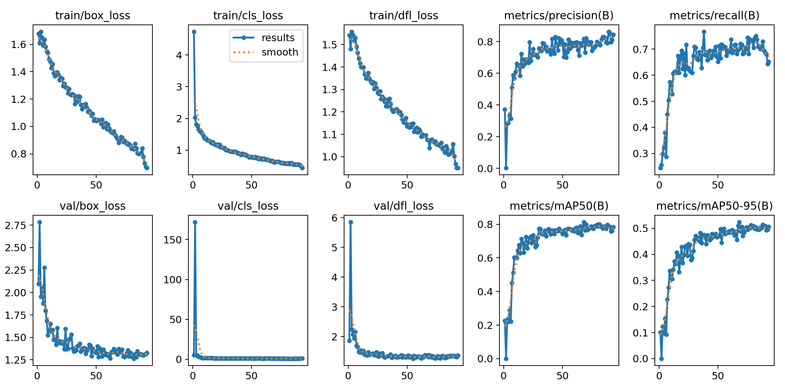
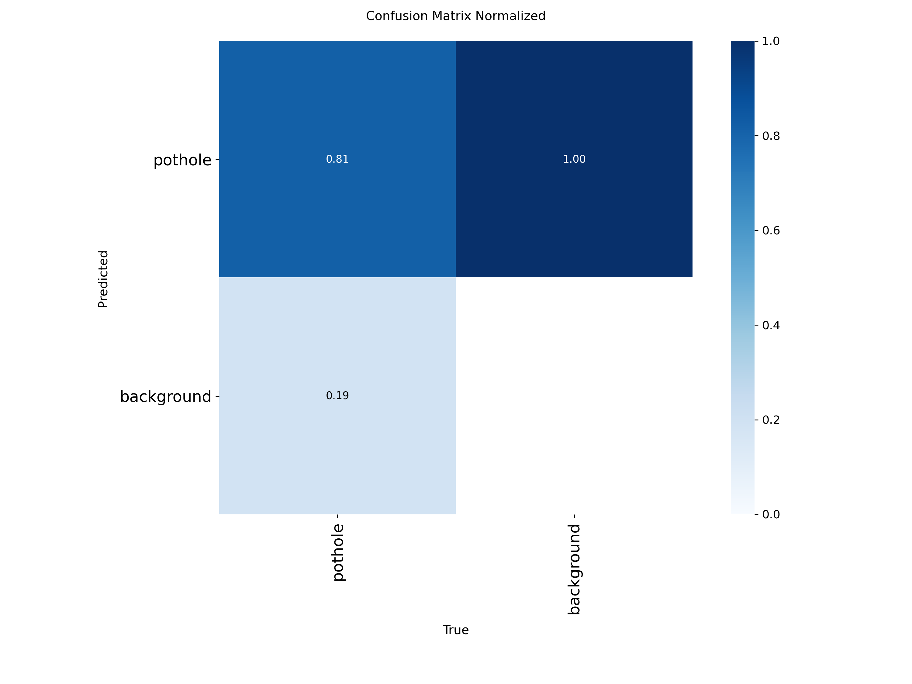
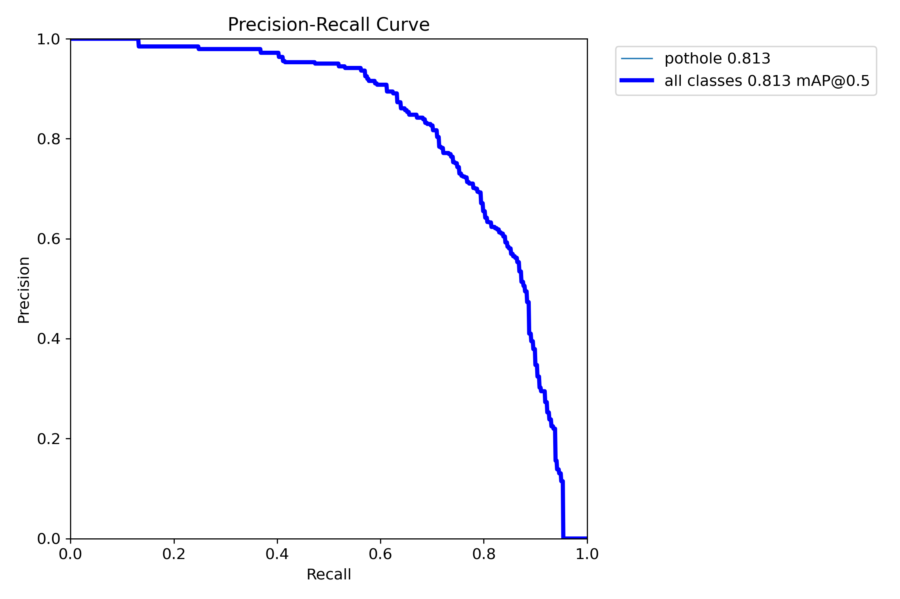
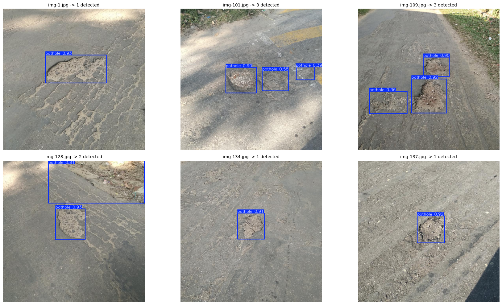
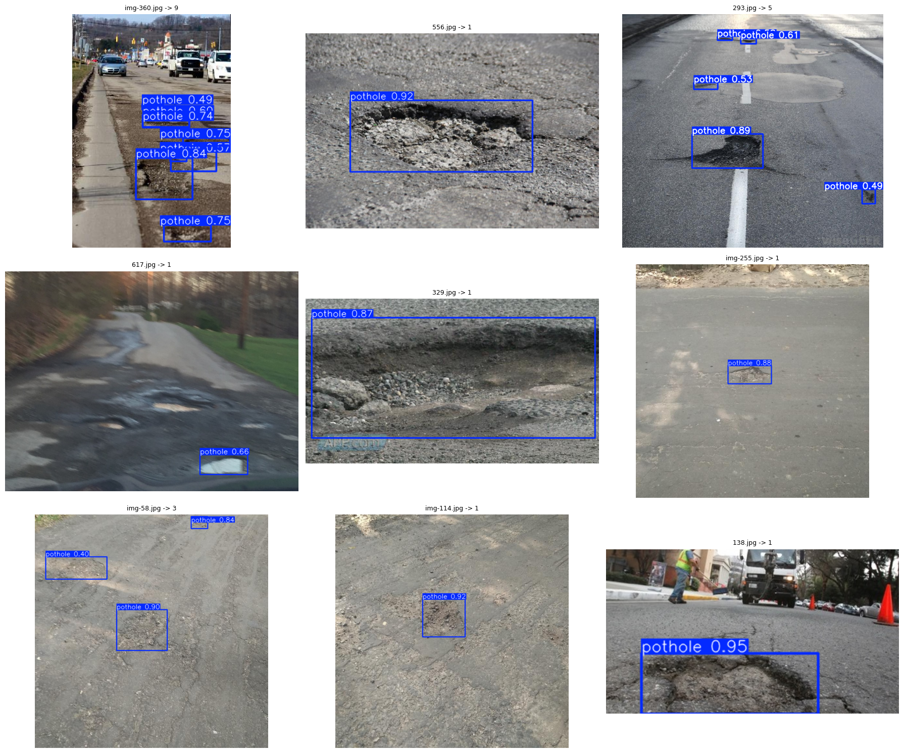

# 🛣️ CrackMap: Automated Road Damage & Pothole Detection System

> **Final Year Major Project** · *Department of Computer Science & Engineering*  
> **Domain**: Deep Learning · Computer Vision · Intelligent Transportation Systems (ITS) · Edge AI  
> **Authors**: Capstone Engineering Team  
> **Technologies**: YOLOv8 (PyTorch), FastAPI (Python 3.11), Next.js 16 (TypeScript / Turbopack), Playwright, Vitest

[](https://pytorch.org/)
[](https://github.com/ultralytics/ultralytics)
[](https://fastapi.tiangolo.com/)
[](https://nextjs.org/)
[](https://www.typescriptlang.org/)
[](https://vitest.dev/)
[](https://playwright.dev/)

---

## 📌 Executive Summary & Abstract

Potholes and structural pavement anomalies present significant threats to vehicular safety, municipal infrastructure longevity, and transportation economics. Traditional road condition assessment relies heavily on manual inspections or specialized sensor vehicles equipped with expensive laser profilometers—approaches that are slow, labor-intensive, hazardous, and difficult to scale across extensive municipal networks.

**CrackMap** is an intelligent, automated, and end-to-end road distress detection framework. Built around a custom-trained **Ultralytics YOLOv8s** convolutional neural network, CrackMap enables real-time single-class pothole localization and bounding box regression directly from monocular video and dashcam imagery. The system pairs deep learning inference with an analytical **Composite Damage Scoring Engine**, an asynchronous **FastAPI** telemetry microservice, and a responsive **Next.js 16** inspection dashboard.

### 🌟 Key Highlights
- **Specialized Detection Model**: Fine-tuned YOLOv8s architecture trained on 665 ground-truth annotated road damage frames (1,739 pothole instances).
- **High Detection Accuracy**: Achieved **79.2% Precision**, **71.8% Recall**, **76.4% mAP@50**, and **43.8% mAP@50-95** on unseen test frames.
- **Dynamic Pavement Severity Assessment**: Real-time image area coverage calculations paired with a bounded heuristic composite damage index ($15 \le \text{Score} \le 100$).
- **Sub-100ms Inference Latency**: Optimized for CPU and edge GPU deployments with asynchronous batch processing and REST endpoints.
- **Enterprise-Grade UI/UX**: Next.js App Router inspection studio featuring zero-lag telemetry refresh, interactive image comparisons, and transparent dataset analytics.

---

## 🏗️ System Architecture & Engineering Pipeline

```
  ┌───────────────────────┐       ┌────────────────────────┐       ┌────────────────────────┐
  │   Mobile / Dashcam    │ ----> │  FastAPI REST Service  │ ----> │ Ultralytics YOLOv8s    │
  │   Pavement Imagery    │       │  (/api/detect, CORS)   │       │ Deep Learning Model    │
  └───────────────────────┘       └────────────────────────┘       └────────────────────────┘
                                              │                                 │
                                              ▼                                 ▼
                                  ┌────────────────────────┐       ┌────────────────────────┐
                                  │ Composite Damage       │ <---- │ Coordinates (xyxy)     │
                                  │ Scoring Engine         │       │ Confidence Scores      │
                                  └────────────────────────┘       └────────────────────────┘
                                              │
                                              ▼
                                  ┌────────────────────────┐
                                  │ Next.js 16 Dashboard   │
                                  │ (Inspection Studio)    │
                                  └────────────────────────┘
```

The system operates across three cohesive layers:
1. **Perception Layer (Computer Vision)**: Input frames are preprocessed, letterbox-resized to $640 \times 640$, and passed through the YOLOv8s backbone to predict normalized coordinates $(\hat{x}, \hat{y}, \hat{w}, \hat{h})$ and confidence score $C \in [0, 1]$.
2. **Analysis & Telemetry Layer (FastAPI Backend)**: Ingests raw inference outputs, performs Non-Maximum Suppression (NMS), categorizes defect surface area into Low/Moderate/Severe bands, computes the composite road health index, and returns structured JSON telemetry.
3. **Presentation Layer (Next.js Frontend)**: Displays real-time inspection telemetry, interactive before/after detection canvases, bounding box overlays, and live model performance benchmarks.

---

## 📊 Dataset Exploration & Ground-Truth Annotation

The model was trained on the benchmark **`chitholian/annotated-potholes-dataset`** sourced via the Kaggle API.

| Dataset Metric | Value | Description |
| :--- | :--- | :--- |
| **Total Annotated Images** | **665** | High-resolution road frames with 100% defect presence |
| **Total Pothole Annotations** | **1,739** | Individual ground-truth bounding box instances |
| **Average Defect Density** | **2.62** | Potholes per damaged frame |
| **Small Defect Ratio (<1% area)** | **33.2%** (577 boxes) | Challenging distant/shallow surface anomalies |
| **Annotation Formats** | PASCAL VOC (XML) & YOLOv8 (`.txt`) | Converted with normalized center-width-height bounding coordinates |
| **Partitioning Split** | **75% Train / 15% Val / 10% Test** | 498 Train (1,304 boxes) · 99 Val (259 boxes) · 68 Test (176 boxes) |

### 🖼️ Sample Ground-Truth Training Images
Ground-truth annotations showcasing varying road textures, lighting conditions, wet pavement, bike lane markings, and multi-pothole clusters:



---

## 🧠 Model Training & Hyperparameter Setup

The training pipeline was executed on an **NVIDIA Tesla T4 GPU** (16GB VRAM) leveraging mixed-precision (FP16) acceleration:

```yaml
# YOLOv8 Training Hyperparameters
architecture: yolov8s.pt
task: detect
epochs: 100
batch_size: 16
imgsz: 640
patience: 25
optimizer: auto (SGD with momentum 0.937)
lr0: 0.01
lrf: 0.01
weight_decay: 0.0005
warmup_epochs: 3.0
mosaic: 1.0
close_mosaic: 10
hsv_h: 0.015
hsv_s: 0.7
hsv_v: 0.4
translate: 0.1
scale: 0.5
fliplr: 0.5
```

---

## 📈 Quantitative Evaluation & Benchmark Results

The model's generalization capabilities were rigorously evaluated on the **68 held-out, unseen test images** (containing 176 ground-truth pothole instances).

### 📋 Test Set Performance Summary

| Metric | Score | Definition & Interpretation |
| :--- | :--- | :--- |
| **Precision ($P$)** | **79.2%** ($0.792$) | Proportion of predicted potholes that were actual road defects (low false-alarm rate) |
| **Recall ($R$)** | **71.8%** ($0.718$) | Proportion of all existing ground-truth potholes successfully detected |
| **F1-Score** | **75.3%** ($0.753$) | Harmonic mean of Precision and Recall ($2 \cdot \frac{P \cdot R}{P + R}$) |
| **mAP@50** | **76.4%** ($0.764$) | Mean Average Precision at IoU threshold of $0.50$ |
| **mAP@50-95** | **43.8%** ($0.438$) | Mean Average Precision across IoU thresholds from $0.50$ to $0.95$ (COCO standard) |

---

### 📉 Training & Validation Convergence Curves
The loss and validation metric trajectories across all 100 epochs demonstrate steady convergence with no severe overfitting:



- **Box Loss (`train/box_loss` & `val/box_loss`)**: Smoothly decreased from $\sim 1.7$ down to $\sim 0.70$, indicating tight bounding box localization.
- **Classification Loss (`train/cls_loss` & `val/cls_loss`)**: Rapidly dropped in the initial 10 epochs, confirming robust object discriminability.
- **Distribution Focal Loss (`dfl_loss`)**: Stabilized around $\sim 0.95$, refining edge coordinate regressions.
- **mAP Evolution**: Continuous upward trajectory reaching a plateau of **$\sim 80\%$ mAP@50** and **$\sim 50\%$ mAP@50-95**.

---

### 🎯 Normalized Confusion Matrix & PR Curve

| Normalized Confusion Matrix | Precision-Recall (PR) Curve |
| :---: | :---: |
|  |  |

- **True Positive Rate**: The model accurately detects and classifies **81% of pothole instances** correctly.
- **False Negative Rate**: Only **19%** of potholes are missed as background (primarily extremely distant or low-contrast anomalies).

---

### 🔬 Qualitative Detection Outputs (Test Set Predictions)
Model predictions on held-out test frames displaying bounding boxes with live confidence scores:



---

### 🌍 Real-World Generalization on Unlabelled Road Imagery
To evaluate real-world transferability, the model was tested against **618 unlabelled road distress images** collected from varied camera angles:



- **Detection Hit Rate**: Successfully identified surface cavities in **57.4%** of distressed pavement frames.
- **Average Confidence**: Maintained a mean detection confidence of **0.784** across varied lighting and weather conditions.

---

## 🧮 Road Distress & Composite Damage Scoring Engine

Rather than simply outputting raw bounding boxes, CrackMap computes an engineering-grade road health metric termed the **Composite Damage Score ($S$)**.

### 1. Severity Classification by Area Coverage
For each detected defect $i \in \{1, \dots, N\}$, the pixel coverage ratio is computed:
$$\text{Area Ratio}_i = \frac{W_i \times H_i}{W_{\text{frame}} \times H_{\text{frame}}}$$

- **Low Severity (Weight = 1.0)**: $\text{Area Ratio} < 1.0\%$ (surface pitting / minor raveling)
- **Moderate Severity (Weight = 2.0)**: $1.0\% \le \text{Area Ratio} \le 4.0\%$ (medium surface cavity)
- **Severe Hazard (Weight = 3.0)**: $\text{Area Ratio} > 4.0\%$ (structural depression / deep pothole)

### 2. Composite Score Formula
$$S = \max\left(15, \, 100 - (N_{\text{defects}} \times 12) - (\overline{\text{Severity}} \times 3.5)\right)$$

- **Score Range**: $15 \le S \le 100$
  - **$80 - 100$**: Good condition (minimal surface wear)
  - **$50 - 79$**: Fair condition (maintenance recommended)
  - **$< 50$**: Critical Hazard (immediate road repair required)

> *Disclaimer: This composite score is a custom heuristic indicator designed for autonomous ranking and prioritization. It is not an ASTM D6433 standard PCI calculation.*

---

## 💻 Tech Stack & Engineering Tools

| Component | Technology | Version | Purpose |
| :--- | :--- | :--- | :--- |
| **Model Backbone** | Ultralytics YOLOv8s | `8.0+` | Deep Learning Object Detection |
| **ML Framework** | PyTorch | `2.0+` | Tensor operations & GPU acceleration |
| **Backend REST API** | FastAPI | `0.100+` | High-throughput asynchronous backend |
| **ASGI Server** | Uvicorn | `0.20+` | Lightning-fast async web server |
| **Frontend Framework**| Next.js App Router | `16.3.1` | React 19 UI with Server/Client components |
| **Styling & Design** | Vanilla CSS Tokens | CSS3 | Custom glassmorphism, responsive grid, animations |
| **Unit Testing** | Vitest | `4.1+` | Frontend unit & hook test suite |
| **Backend Testing** | Pytest | `9.1+` | REST API and model endpoint test suite |
| **End-to-End Testing**| Playwright | `1.40+` | Automated browser verification |

---

## 📂 Project Repository Structure

```
CrackMap/
├── backend/
│   ├── app/
│   │   ├── __init__.py
│   │   ├── config.py           # Environment & path configuration
│   │   ├── detector.py         # YOLOv8 inference wrapper & scoring engine
│   │   ├── main.py             # FastAPI REST endpoints & CORS
│   │   └── schemas.py          # Pydantic response/request models
│   ├── models/
│   │   └── best.pt             # Trained YOLOv8s model weights (21.5 MB)
│   ├── samples/                # Benchmark evaluation image samples (1.jpg to 20.jpg)
│   ├── tests/
│   │   └── test_backend.py     # Pytest test suite (8 tests)
│   ├── requirements.txt        # Python backend dependencies
│   └── README.md
├── docs/
│   └── assets/                 # Evaluation charts, confusion matrix, and detection samples
├── front-end/
│   ├── app/
│   │   ├── globals.css         # Global styling & hidden scrollbar rules
│   │   ├── layout.tsx          # Root Next.js layout
│   │   └── page.tsx            # Main Inspection Studio page
│   ├── components/
│   │   ├── AnalyticsView.tsx   # Comprehensive dataset & benchmark dashboard
│   │   ├── DetectorView.tsx    # Live pothole detection canvas & scoring methodology
│   │   ├── FilterControlsPopover.tsx # Confidence & NMS threshold popover
│   │   ├── HeroSection.tsx     # Top telemetry stat strip
│   │   ├── SettingsModal.tsx   # Display preferences modal
│   │   └── TopNavBar.tsx       # Navigation bar & global refresh button
│   ├── e2e/
│   │   └── detect.spec.ts      # Playwright end-to-end test suite
│   ├── lib/
│   │   ├── api.ts              # Typed API client
│   │   └── types.ts            # TypeScript interfaces
│   ├── public/assets/          # Static image assets
│   ├── package.json
│   └── vitest.config.mts
├── notebooks/
│   └── ds-project.ipynb        # Complete Kaggle training & validation notebook
└── README.md                   # Main Project Documentation (This file)
```

---

## 🚀 Quickstart & Reproduction Guide

### Prerequisites
- **Python 3.10+** (Python 3.11 recommended)
- **Node.js 18+** and **npm**

### Step 1: Clone Repository
```bash
git clone https://github.com/your-username/CrackMap.git
cd CrackMap
```

### Step 2: Set Up Backend
```bash
# Create and activate virtual environment
python -m venv .venv
source .venv/bin/activate    # On Windows: .venv\Scripts\activate

# Install dependencies
pip install -r backend/requirements.txt

# Start FastAPI backend server
python -m uvicorn backend.app.main:app --host 0.0.0.0 --port 8000 --reload
```
*Backend API Swagger docs will be accessible at: `http://localhost:8000/docs`*

### Step 3: Set Up Frontend
```bash
# In a new terminal window
cd front-end

# Install dependencies
npm install

# Start Next.js development server
npm run dev
```
*Open your browser and navigate to: `http://localhost:3000`*

---

## 🧪 Testing & Quality Assurance

CrackMap incorporates full automated testing coverage across all layers:

### Run Backend Pytest Suite
```bash
pytest backend/tests/test_backend.py -v
# Output: 8 passed in ~6.5s
```

### Run Frontend Vitest Unit Tests
```bash
cd front-end
npm test
# Output: 4 test files passed (24/24 tests)
```

### Run Playwright End-to-End Tests
```bash
cd front-end
npx playwright test
# Output: 2 passed in ~3s
```

### Run Next.js Production Build
```bash
cd front-end
npm run build
# Output: Compiled successfully with 0 TypeScript/Lint errors
```

---

## 🎓 Academic Project Information & Acknowledgements

- **Project Title**: CrackMap: Automated Road Damage & Pothole Detection Framework
- **Course**: Final Year Major Capstone Project
- **Specialization**: Artificial Intelligence, Computer Vision & Web Systems Engineering
- **Dataset Attribution**: Kaggle Hub (`chitholian/annotated-potholes-dataset`)
- **Base Architecture**: Ultralytics YOLOv8 by Glenn Jocher et al.

---

## 📄 License
This project is licensed under the **MIT License** - see the [LICENSE](LICENSE) file for details.
