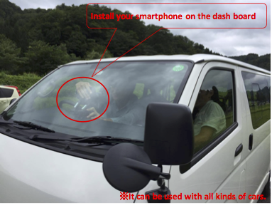
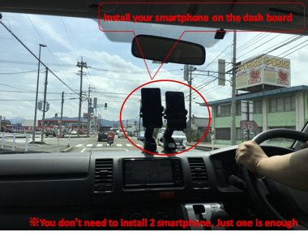
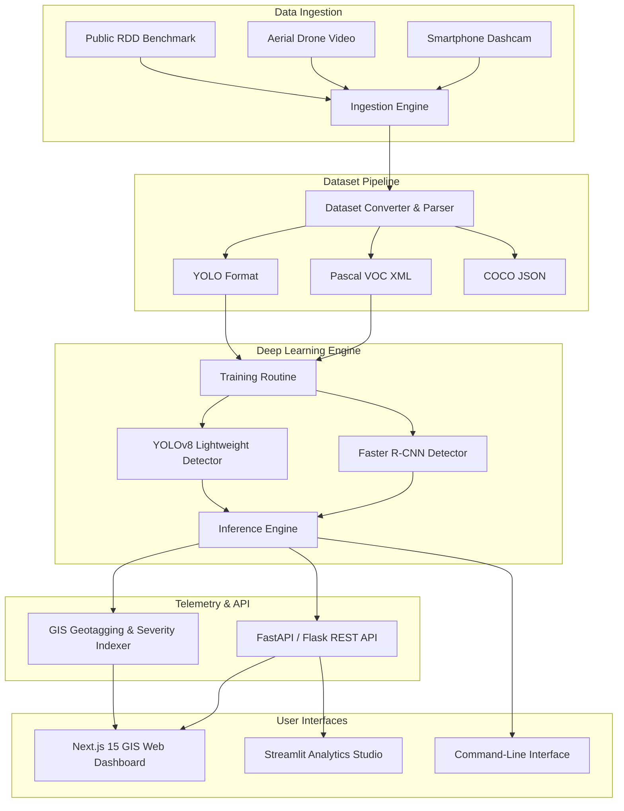
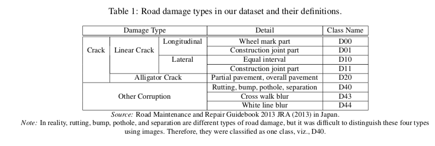

# 🛣️ CrackMap — AI-Powered Autonomous Road Damage Detection & GIS Intelligence

<div align="center">

[](https://python.org)
[](https://pytorch.org)
[](https://ultralytics.com)
[](https://nextjs.org)
[](https://react.dev)
[](https://fastapi.tiangolo.com)
[](https://streamlit.io)
[](./LICENSE)

<br />

**An end-to-end intelligent infrastructure monitoring system that detects, classifies, and maps road surface defects in real time using cutting-edge deep learning, edge crowdsensing, and interactive geospatial GIS telemetry.**

[🚀 Features](#-key-features) • [🧠 Architecture](#-system-architecture) • [📊 Damage Taxonomy](#-damage-classification-taxonomy) • [⚡ Quickstart](#-quickstart-guide) • [🖥️ Web Dashboard](#-interactive-dashboards) • [🧪 Testing](#-testing--quality-assurance) • [📜 Citations](#-research--citations)

</div>

---

## 🌟 Executive Summary & Problem Statement

Road network degradation, from severe potholes to expanding alligator cracks, causes billions of dollars in vehicular damage and poses critical safety hazards globally. Traditional road inspection methods are **slow**, **cost-prohibitive**, **hazardous to human inspectors**, and suffer from **delayed municipal response times**.

**CrackMap** bridges the gap between state-of-the-art computer vision and municipal infrastructure operations:
- **Autonomous Detection**: Deep neural network ensemble (YOLOv8 + Faster R-CNN) detects road anomalies at 60+ FPS on edge and server hardware.
- **Geospatial GIS Telemetry**: Automatic GPS geotagging, severity indexing, and spatial heatmap generation for instant municipal prioritization.
- **Multi-Model Equalizer**: Real-time side-by-side model comparison, confidence tuning, and benchmarking suite.
- **Zero-Friction Ingestion**: Works with smartphone dashcams, drone aerial footage, or high-res vehicle inspection rigs.

---

## 📸 System In Action & Edge Deployment

<div align="center">
  <table>
    <tr>
      <td align="center" width="50%">
        
        <br />
        <b>Edge Crowdsensing: Car Dashboard Mount</b>
      </td>
      <td align="center" width="50%">
        
        <br />
        <b>Real-Time Visual Capture Ingestion</b>
      </td>
    </tr>
  </table>
</div>

---

## ✨ Key Features

| Feature | Description |
| :--- | :--- |
| 🎯 **Dual Architecture DL Pipeline** | Custom Faster R-CNN PyTorch models combined with fine-tuned Ultralytics YOLOv8 for sub-second object localization. |
| 🗺️ **Interactive GIS Map** | Real-time map displaying geolocated road defects with color-coded severity markers, cluster breakdown, and telemetry pins. |
| 🎛️ **Multi-Model Equalizer** | Compare inference outputs across multiple checkpoints (`keremberke_pothole_yolov8`, `custom_fine_tuned_detector`) with interactive threshold sliders. |
| 🔄 **Universal Dataset Pipeline** | Seamless bi-directional conversion between **Pascal VOC XML**, **YOLO (`.txt`)**, and **COCO (`.json`)** dataset schemas. |
| 📊 **Advanced Analytics & Confusion Metrics** | Comprehensive mAP@0.5, Precision, Recall, F1-scores, and categorical damage distribution charts. |
| 💻 **Multi-Tier User Interfaces** | Next.js 15 Dark-Themed Glassmorphic Web App, Streamlit ML Experimentation Studio, and headless CLI tool. |
| 🏎️ **Batch & Video Stream Inference** | Process single frames, full batch directories, or live video feeds with bounding-box rendering and metadata export. |

---

## 🧠 System Architecture



---

## 🏷️ Damage Classification Taxonomy

CrackMap supports standard municipal and academic damage classes based on the Global Road Damage Detection challenge standards:

<div align="center">
  
</div>

<br />

| Class Code | Damage Category | Description | Severity Impact |
| :---: | :--- | :--- | :---: |
| `D00` | **Longitudinal Crack (Wheel Mark)** | Cracks running parallel to traffic flow inside wheel paths | Medium |
| `D01` | **Longitudinal Crack (Construction Joint)** | Cracks along road paving and construction joints | Low – Medium |
| `D10` | **Transverse Crack (Equal Interval)** | Cross-lane cracks caused by thermal shrinkage / base movement | Medium |
| `D11` | **Transverse Crack (Construction Joint)** | Cross-lane cracks at construction seams | Low – Medium |
| `D20` | **Alligator Crack (Fatigue)** | Interconnected polygonal pattern indicating structural base failure | **Critical** |
| `D40` | **Pothole / Rutting / Bump** | Severe road surface cavity, structural separation, and rutting | **Severe / Urgent** |
| `D43` | **Crosswalk Marking Blur** | Worn and faded pedestrian crosswalk paint | Medium |
| `D44` | **Lane Marking Blur** | Worn and faded lane and boundary road markings | Medium |


---

## 📂 Repository Structure

```text
CrackMap/
├── app.py                     # Streamlit Interactive Explorer & Visualizer
├── backend_server.py          # REST API Server (Detection, Telemetry, Training)
├── run_cli.py                 # Unified Command-Line Runner
├── crackLabelMap.txt          # Label Map definition file
├── requirements.txt           # Python dependencies
├── src/
│   ├── config.py              # Central project configuration & paths
│   ├── dataset/
│   │   ├── voc_parser.py      # Pascal VOC XML parser & validator
│   │   ├── converter.py       # VOC ↔ YOLO ↔ COCO dataset converters
│   │   ├── visualizer.py      # Bounding box & label visualization
│   │   └── downloader.py      # Automated RDD dataset downloader
│   ├── models/
│   │   ├── detector.py        # Base detector PyTorch architecture
│   │   ├── advanced_detector.py # YOLOv8 & transfer-learning wrapper
│   │   ├── train.py           # Training loop, loss curves & scheduler
│   │   ├── evaluate.py        # Precision, Recall, mAP & confusion metrics
│   │   └── inference.py       # Single-image & batch inference engine
│   └── ui_components.py       # Streamlit UI layouts, metrics & graphs
├── frontend/                  # Modern Next.js 15 React Dashboard
│   ├── app/                   # App Router (globals.css, layout, page)
│   ├── components/            # GisMap, Equalizer, DetectorView, TrainView
│   ├── lib/                   # API client, hooks, and types
│   ├── e2e/                   # Playwright End-to-End test suites
│   └── vitest.config.mts      # Vitest configuration & unit tests
├── models_saved/              # Pretrained and fine-tuned model checkpoints
├── protos/                    # Protocol buffer definitions & compiled pb2
├── utils/                     # Object detection utility scripts & metrics
├── samples/                   # Sample images & Pascal VOC / YOLO annotations
├── tests/
│   └── test_pipeline.py       # Pytest automated test suite
└── images/                    # Documentation diagrams & setup photos
```

---

## ⚡ Quickstart Guide

### 1. Prerequisites
- Python 3.10+ (Python 3.11 recommended)
- Node.js 18+ & npm
- PyTorch 2.0+ (CUDA optional for GPU acceleration)

### 2. Clone and Setup Environment
```bash
# Clone repository
git clone https://github.com/vinitgirdhar/CrackMap.git
cd CrackMap

# Create and activate virtual environment
python -m venv venv
# Windows:
.\venv\Scripts\activate
# Linux/macOS:
source venv/bin/activate

# Install Python dependencies
pip install torch torchvision torchaudio --extra-index-url https://download.pytorch.org/whl/cu118
pip install ultralytics streamlit flask flask-cors opencv-python pillow matplotlib pytest
```

### 3. Launch Next.js GIS Dashboard + REST API
```bash
# Terminal 1: Start the Python Backend API Server
python backend_server.py
# -> Running on http://127.0.0.1:5000

# Terminal 2: Start the Next.js Modern Frontend
cd frontend
npm install
npm run dev
# -> Ready at http://localhost:3000
```

### 4. Launch Streamlit Analytics Studio
```bash
streamlit run app.py
# -> Running at http://localhost:8501
```

---

## 🖥️ Interactive Dashboards

### 1. Next.js Modern GIS Dashboard (`http://localhost:3000`)
- **Live GIS Map View**: Real-time road condition telemetry with dynamic clustering and defect radius markers.
- **Model Equalizer**: Adjust confidence thresholds, NMS IoU, and switch between YOLOv8 and Faster R-CNN in real-time.
- **Training Monitor**: Live epoch loss progress, learning rate curve, and training triggers.
- **Defect Inspector**: Upload custom road photos or select from benchmark samples to view instant visual overlays.

### 2. Streamlit ML Studio (`http://localhost:8501`)
- Dataset inspection & Pascal VOC XML annotation parser.
- Model performance metrics (Confusion matrices, Precision-Recall curves).
- Batch inference on entire directories with downloadable report summaries.

---

## 💻 CLI Usage Guide

The `run_cli.py` script provides headless automation for training, evaluation, and inference:

```bash
# 1. Run inference on a sample image
python run_cli.py --mode detect --input samples/JPEGImages/sample_001.jpg --output results/

# 2. Evaluate model performance against test dataset
python run_cli.py --mode evaluate --annotations test_samples/Annotations/ --images test_samples/JPEGImages/

# 3. Train detector model
python run_cli.py --mode train --data-dir samples/ --epochs 25 --batch-size 8 --lr 0.001

# 4. Convert dataset from Pascal VOC to YOLO format
python run_cli.py --mode convert --src samples/Annotations/ --format yolo --dest samples/yolo_out/
```

---

## 🧪 Testing & Quality Assurance

CrackMap incorporates automated unit, integration, and end-to-end testing across Python and TypeScript stacks:

```bash
# Run Python Pipeline & ML Unit Tests
pytest tests/test_pipeline.py -v

# Run Frontend Unit Tests (Vitest)
cd frontend
npm run test

# Run Frontend End-to-End Tests (Playwright)
npx playwright test
```

---

## 🔮 Hackathon Roadmap & Future Innovations

- [x] **Phase 1**: Dual-model DL architecture (YOLOv8 + Faster R-CNN) with Pascal VOC & YOLO converters.
- [x] **Phase 2**: Real-time GIS interactive dashboard & REST API server.
- [x] **Phase 3**: Multi-model equalizer & interactive threshold tuner.
- [ ] **Phase 4**: Edge deployment on Raspberry Pi / NVIDIA Jetson with onboard GPS module.
- [ ] **Phase 5**: Automated municipal work-order ticket creation via City GIS Webhook integrations.
- [ ] **Phase 6**: Generative AI road repair cost estimation based on defect volume & surface area.

---

## 📜 Research & Citations

If you build upon or reference CrackMap in academic work, please acknowledge the original Road Damage Detection benchmarks:

```bibtex
@article{arya2024rdd2022,
  title={RDD2022: A multi-national image dataset for automatic road damage detection},
  author={Arya, Deeksha and Maeda, Hiroya and Ghosh, Sanjay Kumar and Toshniwal, Durga and Sekimoto, Yoshihide},
  journal={Geoscience Data Journal},
  volume={11},
  number={4},
  pages={846--862},
  year={2024},
  publisher={Wiley Online Library}
}

@inproceedings{arya2024orddc,
  title={ORDDC’2024: State of the art solutions for optimized road damage detection},
  author={Arya, Deeksha and Omata, Hiroshi and Maeda, Hiroya and Sekimoto, Yoshihide},
  booktitle={2024 IEEE International Conference on Big Data (BigData)},
  pages={8430--8438},
  year={2024},
  organization={IEEE}
}
```

---

## 📄 License & Acknowledgments

- **Source Code**: Released under the [MIT License](./LICENSE).
- **Benchmark Datasets**: Available under [Creative Commons Attribution-ShareAlike 4.0 International](https://creativecommons.org/licenses/by-sa/4.0/) (CC BY-SA 4.0).
- Special thanks to the **IEEE Big Data Cup**, **Seki Lab (University of Tokyo)**, and the global research community advancing intelligent transport infrastructure!

<div align="center">
  <sub>Built with ❤️ for resilient, safer roads everywhere.</sub>
</div>
